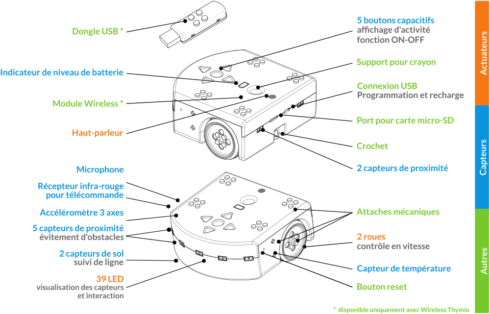

# THYMIO II PLAYGROUND

Premiers pas avec Thymio II.

## MOOC EPFL

https://courseware.epfl.ch/courses/course-v1:EPFL+THYMIO+2019/about

## Installer l’environnement de programmation

https://www.thymio.org/fr/programmer/

> On peut utiliser l’environnement de programmation avec un ou plusieurs vrais Thymios ou avec un simulateur. Les simulateurs sont fournis dans des cartes (maps). Ce dépôt Git en contient quelques-unes dans le répertoire `maps`.

L’environnement de programmation permet de programmer Thymio avec 4 langages différents :

- VPL
- Scratch
- Blockly
- Aseba

> les programmes écrits avec Scratch sont exécutés sur l’ordinateur et pas sur le robot. Le câble doit donc toujours rester connecté pour la version fillaire de Thymio.
> les environnements de programmation Scratch et Blockly sont exécutés dans un navigateur. Aseba recommande d’utiliser Chrome. Firefox semble poser quelques problèmes.

## Vidéos première programmation

- [Introduction au robot Thymio (1/4) Thymio et ses comportements de base](https://youtu.be/Qc6nL8twWSI)
- [Introduction au robot Thymio (2/4) La programmation visuelle VPL](https://youtu.be/dA-BW38kl6E)
- [Introduction au robot Thymio (3/4) La programmation visuelle avancée VPL](https://youtu.be/l2JRdcBNIdY)
- [Introduction au robot Thymio (4/4) La programmation textuelle](https://youtu.be/IpL5k78kXVI)

## De quoi Thymio est composé

http://wiki.thymio.org/fr:thymiospecifications

Microcontroleur : Microchip PIC24FJ128GB106

## Sons

http://wiki.thymio.org/fr:thymiosoundlibrary

> Pour la carte microSD choisir une carte normale (éviter SDHC ou SDXC) de 2 ou 4 GB (<http://wiki.thymio.org/fr:thymiomicrosd>).

